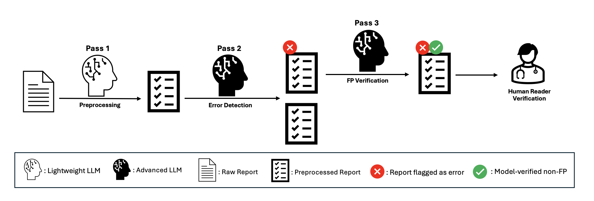
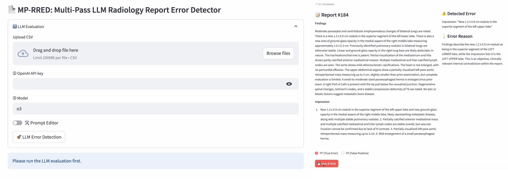

# 📑 MP‑RRED: Multi‑Pass LLM Radiology Report Error Detector




---

## Installation

1. Clone the repository and enter it:

```bash
git clone https://github.com/radssk/mp-rred.git
cd mp-rred
```

2. Create and activate an `mm-rred` conda environment:
```bash
conda create -n mp-rred python=3.10 -y
conda activate mp-rred
```

3. Install dependencies:
```bash
pip install -r requirements.txt
```

4. Launch the app:
```bash
streamlit run app.py
```

---

## Usage

1. **Upload** a CSV containing a `report` column.
2. **Enter** OpenAI API key & model (any JSON‑Schema–compatible, e.g. o4-mini, o3). *Model choice affects only 2nd & 3rd passes.*
3. Click **LLM Error Detection**.
4. For each flagged report, select **True Error** or **False Positive** → **Save & Next**.
5. When finished, review the summary statistics. **Final results are saved** in your current working directory.

---

## Citation

If this tool aids your research, please cite our preprint:

```bibtex
@misc{lastname2025llmstreamlit,
  title  = {LLM Streamlit Demo},
  author = {Lastname, First and Coauthors},
  note   = {arXiv:XXXX.XXXXX},
  year   = {2025}
}
```
